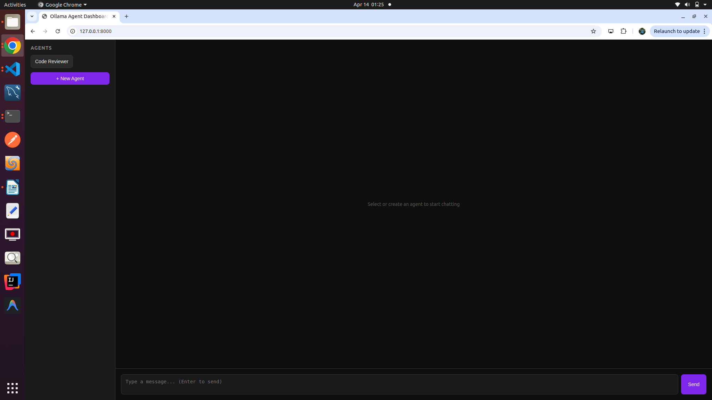

# 🤖 Ollama Agent Dashboard

> Create, manage, and chat with custom AI agents — 100% local, 100% private.



No cloud. No API keys. No data leaving your machine. Just your local models, with a clean interface to build agents on top of them.

---

## ✨ Features

- 🧠 **Custom Agents** — Create agents with custom system prompts (Code Reviewer, Research Assistant, anything)
- 🔌 **All Ollama Models** — Automatically detects every model you have installed
- 💬 **Full Chat History** — Conversations stay in context during your session
- 🔒 **100% Private** — Everything runs locally, nothing sent to the cloud
- ⚡ **Lightweight** — FastAPI backend + plain HTML, no heavy frameworks

---

## 🚀 Quick Start

**Prerequisites:** Python 3.8+ and [Ollama](https://ollama.ai) running locally

```bash
git clone https://github.com/AshwiniSC/ollama-agent-dashboard
cd ollama-agent-dashboard
python -m venv venv
source venv/bin/activate
pip install -r requirements.txt
uvicorn main:app --reload --port 8000
```

Open your browser at `http://localhost:8000`

---

## 🛠️ How to Use

1. Click **+ New Agent**
2. Give it a name and system prompt (e.g. *"You are a senior Python code reviewer"*)
3. Pick your Ollama model
4. Start chatting

---

## 🗺️ Roadmap

- [ ] Streaming responses
- [ ] Agent templates (prebuilt prompts)
- [ ] Export chat history
- [ ] Multi-agent pipelines

---

## 🤝 Contributing

PRs welcome! If you have a feature idea, open an issue first.

---

## 📄 License

MIT — free to use, modify, and distribute.